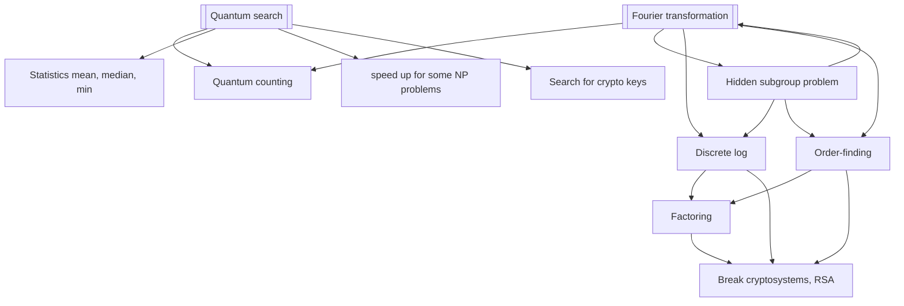

# Overview
- Quantum search
- Quantum Fourier Transformation

```mermaid
graph TD
id1[[Quantum search]] & id3[[Fourier transformation]]--> id2[Quantum counting]
id4[Hidden subgroup problem] --> id3
id3 --> id4
id3 & id4 --> id5[Discrete log] & id6[Order-finding]
id5 & id6 --> id7[Factoring]
id5 & id6 & id7 --> id8[Break cryptosystems, RSA]
id1 --> id9[Statistics mean, median, min] & id10[speed up for some NP problems] & id11[Search for crypto keys]
```

![[QCQI_fig4.1.png]]